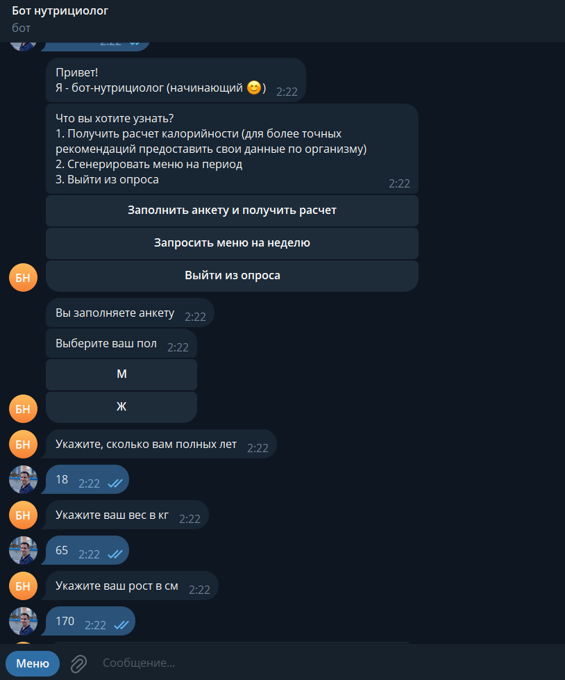
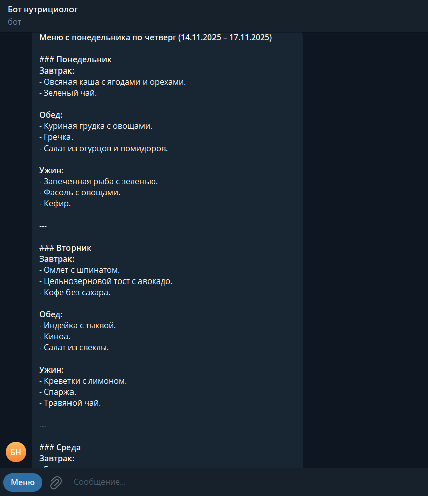
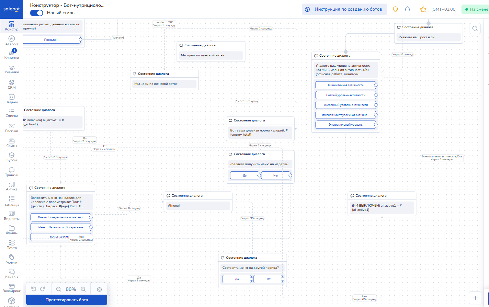

## Учебный проект
# 🍽️ **NutriBot — AI-чат-бот для персонализированного расчёта калорий и составления меню**

> *Умный помощник для здорового питания: рассчитывает норму калорий по формуле Миффлина-Сан Жеора и генерирует недельное меню с помощью ИИ*

---

## 📌 Обзор проекта

**NutriBot** — это интерактивный чат-бот на платформе **Salebot**, который помогает пользователям выйти на осознанное питание. Бот последовательно:

1. **Анкетирует** пользователя (пол, возраст, вес, рост, уровень активности)  
2. **Рассчитывает** суточную норму калорий по современной формуле **Миффлина-Сан Жеора**  
3. Учитывает цель: поддержание веса, похудение или набор массы  
4. Генерирует **персонализированное недельное меню** с помощью искусственного интеллекта  

Проект идеально подходит для студентов, начинающих следить за питанием, а также для всех, кто хочет избежать шаблонных диет и получить реальную пользу от персонализированного подхода.

Запуск чат-бота: [https://t.me/kdr_quiz_bot](https://t.me/damirka_nutricio_test_bot))

---

## 🔢 Как рассчитываются калории?

Для точного определения суточной потребности в энергии бот использует **формулу Миффлина-Сан Жеора (2005)** — современную и более точную альтернативу устаревшей формуле Харриса-Бенедикта.

### 🧮 Формула Миффлина-Сан Жеора

#### 1. Основной обмен (BMR):
- **Для мужчин**:  
  `(10 × вес в кг) + (6,25 × рост в см) – (5 × возраст в годах) + 5`
- **Для женщин**:  
  `(10 × вес в кг) + (6,25 × рост в см) – (5 × возраст в годах) – 161`

#### 2. С учётом уровня физической активности (TDEE):
Результат умножается на коэффициент активности **A**:

| Уровень активности | Коэффициент A |
|--------------------|---------------|
| Минимальная (сидячая работа, нет тренировок) | 1,2 |
| Слабая (1–3 тренировки в неделю) | 1,375 |
| Средняя (3–5 тренировок в неделю) | 1,55 |
| Высокая (ежедневные тренировки) | 1,725 |
| Экстра-активность (спортсмены, тяжёлая работа) | 1,9 |

#### 3. Коррекция под цель:
- **Поддержание веса**: TDEE  
- **Похудение**: TDEE – 15–20%  
- **Набор массы**: TDEE + 10–15%

> 💡 *Формула актуальна для людей в возрасте от 13 до 80 лет.*

---

## 🧠 Пример расчёта

**Пользователь**: мужчина, 28 лет, 75 кг, 178 см, средняя активность, цель — похудение

1. BMR = `(10 × 75) + (6,25 × 178) – (5 × 28) + 5 = 1702,5 ккал`  
2. TDEE = `1702,5 × 1,55 = 2639 ккал`  
3. Норма для похудения = `2639 × 0,8 = 2111 ккал/день`

---

## 🥗 Персонализированное меню с ИИ

На основе:
- рассчитанной нормы калорий  
- целей (похудение, набор и др.)  
- предпочтений (вегетарианец, без глютена, лакто-овово и т.п.)  
- доступных продуктов  

...бот использует **искусственный интеллект** для генерации реалистичного и разнообразного меню на **7 дней**.

### Пример дня (цель — похудение, ~2100 ккал):

| Приём пищи | Блюдо | Калории | БЖУ |
|-----------|--------|---------|-----|
| Завтрак | Овсянка с бананом и орехами | 450 | 15/18/55 |
| Перекус | Йогурт + яблоко | 200 | 8/3/32 |
| Обед | Куриная грудка, гречка, овощи | 620 | 48/12/78 |
| Полдник | Творог с мёдом | 180 | 20/5/15 |
| Ужин | Рыба на пару, киноа, брокколи | 500 | 35/15/50 |
| **ИТОГО** | | **1950 ккал** | **126/53/230** |

> ✅ Меню включает:
> - Порции
> - Подсчёт БЖУ
> - Альтернативы на случай отсутствия ингредиентов
> - Варианты для разных времени года и бюджета

---

## 🖼️ Скриншоты интерфейса

Пример диалога:

Фрагменты схемы в конструкторе Salebot: 

## 🛠️ Техническая реализация

| Компонент | Описание |
|----------|----------|
| **Платформа** | [Salebot](https://salebot.pro/) — для создания ветвящихся диалогов |
| **Расчёт калорий** | Реализовано по формуле Миффлина-Сан Жеора с учётом пола, возраста, веса, роста и активности |
| **Цели** | Поддержание, похудение, набор массы (с коррекцией ±%) |
| **Генерация меню** | На основе ИИ-логики (правила + обученные шаблоны) |
| **Интеграция** | Telegram, VK, WhatsApp, веб-версия |
| **Аналитика** | Отслеживание прохождения, популярных целей, отказов |

---

## 🎯 Целевая аудитория

- Студенты и молодые специалисты  
- Люди, начинающие заботиться о здоровье  
- Те, кто хочет похудеть или нарастить мышцы осознанно  
- Коучи и тренеры (как инструмент для клиентов)

## Скриншоты интерфейса:

## 🚀 Преимущества NutriBot

- ✅ **Точность расчётов** — по современной формуле Миффлина-Сан Жеора  
- ✅ **Персонализация** — не шаблон, а уникальное меню под вас  
- ✅ **Простота** — всё в привычном мессенджере, без приложений  
- ✅ **Образовательность** — пользователь видит, как рассчитаны калории  
- ✅ **Масштабируемость** — легко добавить новые диеты, аллергии, рецепты

---

## 📅 План развития

| Этап | Задача |
|------|-------|
| v1.0 | MVP: анкета + расчёт + базовое меню |
| v1.1 | Поддержка аллергий и диет (веган, кето, без глютена) |
| v1.2 | Генерация списка покупок |
| v2.0 | Экспорт в PDF / Google Таблицы |
| v3.0 | Распознавание еды по фото (AI Vision) |

---

## 📬 Контакты

По вопросам сотрудничества, доработки или тестирования:  
📧 e-mail: [kagirovd4@yandex.ru](mailto:kagirovd4@yandex.ru) Telegram: [https://t.me/kagirovd_b](https://t.me/kagirovd_b)

 Телеграм-бот доступен по ссылке: [https://t.me/damirka_nutricio_test_bot](https://t.me/damirka_nutricio_test_bot)

---

> 🌱 **Здоровое питание — это не жертва. Это знание. NutriBot делает его доступным.**  
> *Основано на научных данных. Создано с заботой.*

